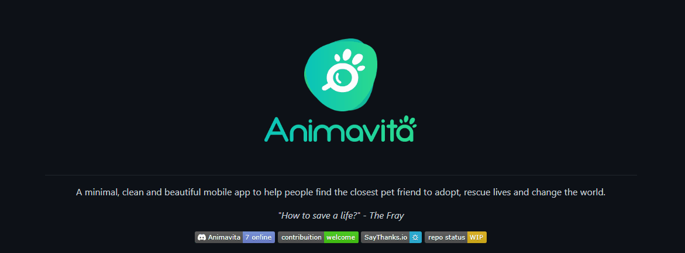

# Projeto com README
Um projeto de teste com um arquivo README🚀

[](https://google.com) 

## Tecnologias utilizadas
- HTML
- CSS
- JS

## Como utilizar

1 - Clone para o projeto
````
git clone <url>
````
2 - Acesse a pasta do projeto
````
cd repositorio-com-readme
````